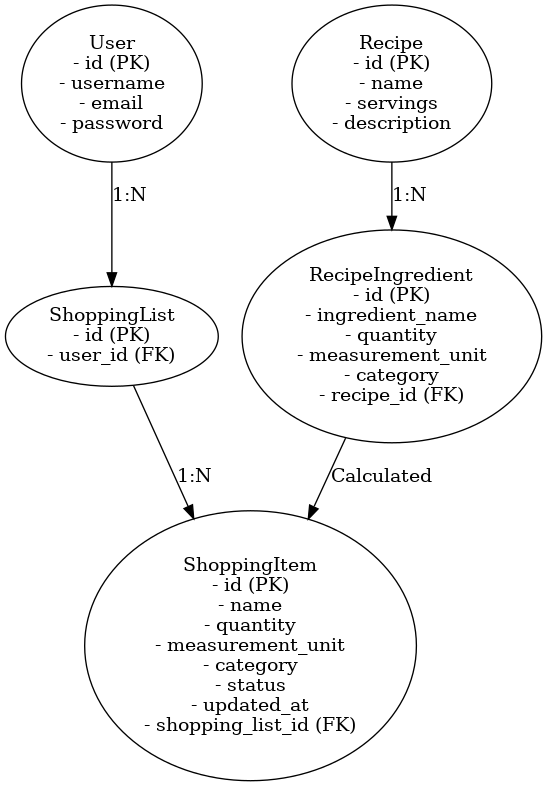

## Features

### MVP: Must-have features

- User Authentication:
  - Users can create accounts, log in and log out
  - Users have access to interactive features on the site only when logged it
  - Login state must be reflected in the UI
  - Features like the shopping list or the functionality of adding and editing items is are not accessible to guests
- Shopping List (CRUD)
  - Users can create, read, update and delete individual grocery items (favorites/staples) that are not tied to recipes
  - These items are stored in a persistent favorites/staples list that is editable by the user

### Should-have features

- Recipes selection + number of servings
  - Recipes are provided on the website and can be viewed and selected by users
  - Users can specify the number of servings for each recipe
- Each recipe has predefined grocery items (ingredients) with specified quantities per serving
  - Grocery items for selected recipes in the quantity defined by selected servings is added to the shopping list

Update 21.01.2025:
Django model helper method or separate utility function for the merging logic of shopping items.

### Could-Have features

**P0**
- Recipe Request Form
  - Users can suggest new recipes or provide feedback to the admin via a form

**P1**
- Categorized Shopping List
  - Group grocery items into categories (e.g., produce, dairy, grains) in the shopping list
- Bulk action: Deselect all recipes/delete all items on the shopping list

**P2**
- Exemplary Weekly Meal Plan
  - Display selected recipes in a weekly meal plan format for the user

### Won’t-Have features

- For now: one-to-one relationship between a user and their shopping list. Future feature: Shared Shopping Lists! (refactor the model for a many-to-many relationship model for multiple users being linked to one shopping list)
- User profile page apart from shopping list
- Comments and likes for recipes
- Portion size options for recipes (small, regular, large)
- Customizable weekly meal plans (drag-and-drop recipe servings)

## UX 

### Epics

Topics: 
- Authentication 
- Shopping List
- Staples (List)
- Recipes

## Data

### ERD 

1. User to ShoppingList: Each user can have one shopping list (1:N relationship)
2. ShoppingList to ShoppingItem: A shopping list can have multiple items (1:N relationship)
3. Recipe to RecipeIngredient: A recipe can include multiple ingredients (1:N relationship)
4. RecipeIngredient to ShoppingItem: Ingredients from recipes contribute to items in the shopping list through calculations (conceptual connection?)

ER Diagram (click me)

