# Smart Prep
## Ahead of your list of household staples

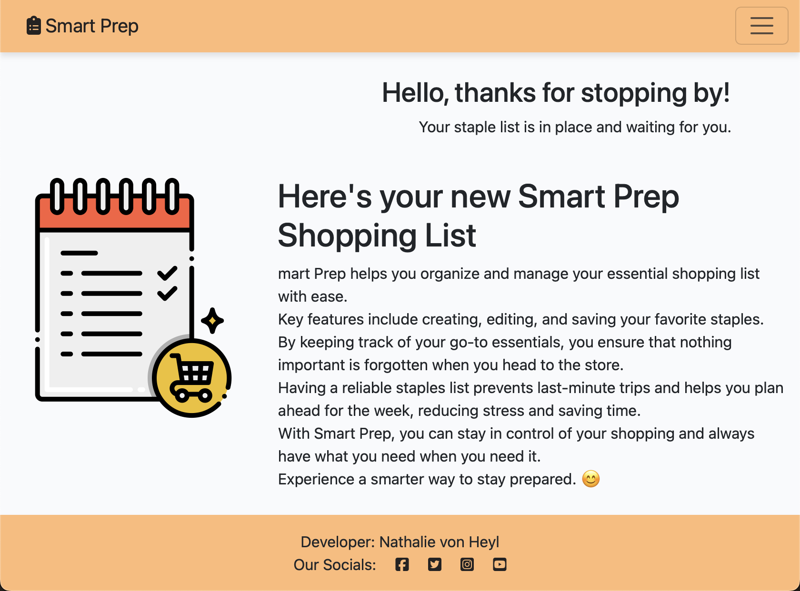

View the live website here: [Live website](https://pp4-smart-prep-3a48b801b9d3.herokuapp.com)

## About

Smart Prep - 4th Portfolio Project for the Diploma in Full Stack Software Development with Code Institute. It is a full-stack website built with Django to help users stay on top of their household staples and favorites. Each user has access to a personal staples list that allows to keep track of the user's all-time-staples.

## UI/UX

### Agile 

This project was designed and built using the agile approach. Right from the initial planning through to final development. To help visualise the process I created a [GitHub project](https://github.com/users/nathiedeheyl/projects/6/views/1?visibleFields=%5B%22Title%22%2C%22Assignees%22%2C%22Status%22%2C161882236%2C%22Labels%22%5D) and utilised the provided Kanban board method to split project elements into user stories and manageable tasks.

To view all user stories including their required acceptance criterias and tasks, refer the project linked to above. Each story also has been tagged with a label to signify how crucial a particular feature is to the overall workings and acceptability of the site.

### Wireframes

Homepage Wireframes

Desktop Home page

Tablet Home page

Mobile Home page

Mobile Home page with Dropdown Menu

### Design

#### Color Scheme

[Color Scheme Choice](docs/ux/0_desgin_color.png)

### Target Audience

- People who would like to reduce costs of living by avoiding buying groceries in excess
- Users who would like shop more efficiently and less often (having an organised shopping list with staples to select from makes sure people can go grocery shopping once a week and therefore save time)
- People who like to plan their grocery shopping to easier buy what is needed

### User Requirements and Expectations

- Accessible and responsive website
- Intuitive website with a layout allowing to easily navigate through it
- Easy access to Create, Read, Update & Delete (CRUD) functionalities
- Links and features that function in accordance with their intended purpose
- A contact form to contact the website owner

## Features

### MVP: Must-have features

- User Authentication:
  - Users can create accounts, log in and log out
  - Users have access to interactive features on the site only when logged it (interactive feature: CRUD staple items in a personal staples list)
  - Features like the personal staples with functionality of adding, editing, and deleting items are not accessible to visitors
  - Login state must be reflected in the UI of homepage
- Personal Staples (CRUD)
  - Users can create, read, update and delete individual staple items
  - These staple items are stored in a persistent personal list of staples (personal meaning each user sees their own list of staples) that is editable by the user

### Existing features

#### Header

Expand to see header features

 

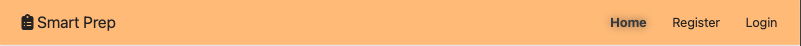
 The Header feature

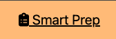
 The Brand Name and Link to Home Page

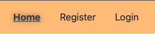
 Navigation bar

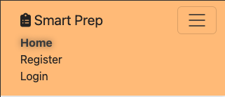
 Navigation bar: Responsive with toggle down menu for mobile screens

 Footer Feature with Social Media Links

#### Greeting to authenticated users

Expand to see greeting features

 

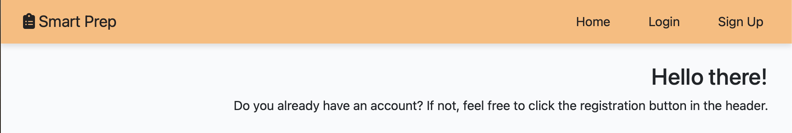
 Greeting to unauthenticated user

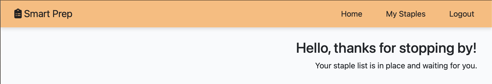
 Greeting to authenticated user

#### Introduction and welcoming paragraph on home page

Expand to see home page features

 

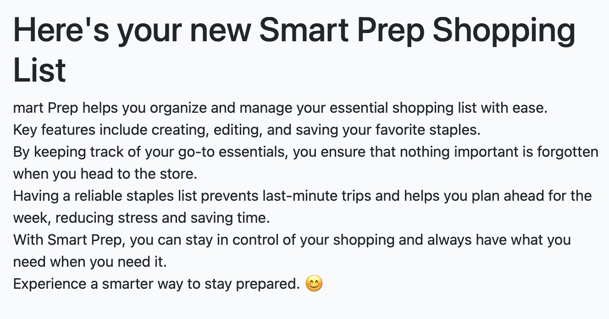
 Welcoming intro paragraph to explain the website's purpose and features to the user

#### My Staples List and Features

Expand to see Personal Staple List features

 

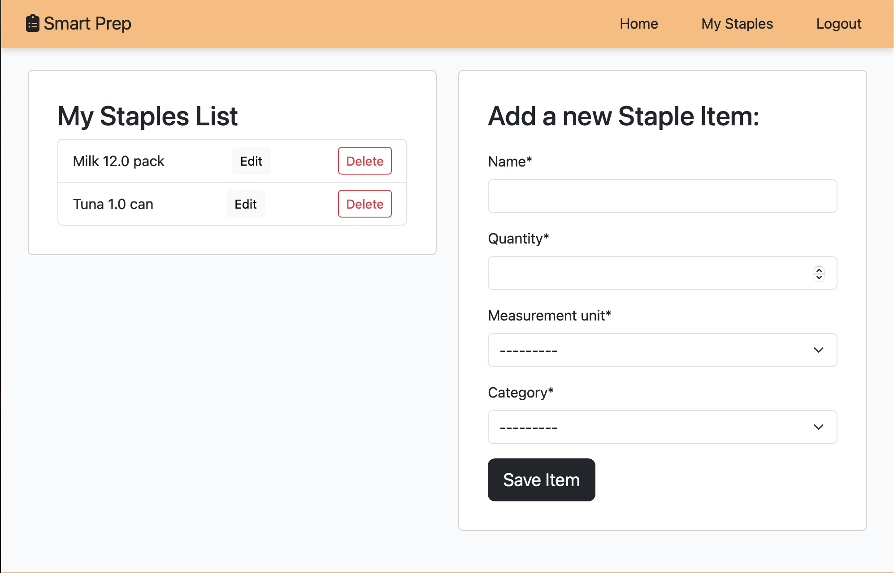
 The Staples List

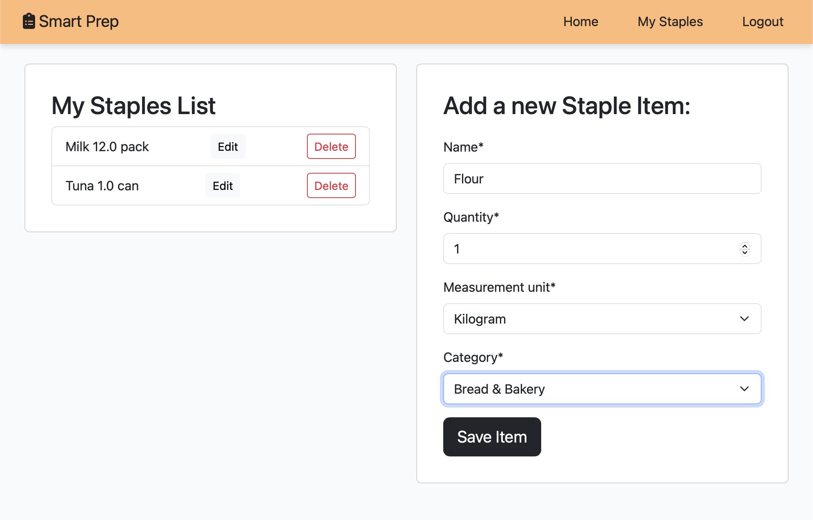
 Adding an Item

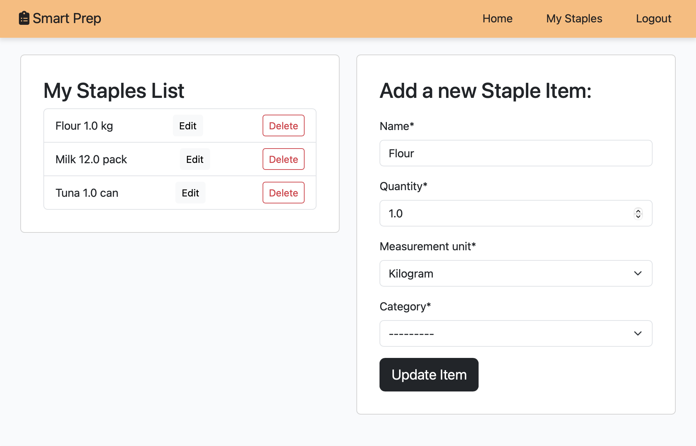
 Editing an Item

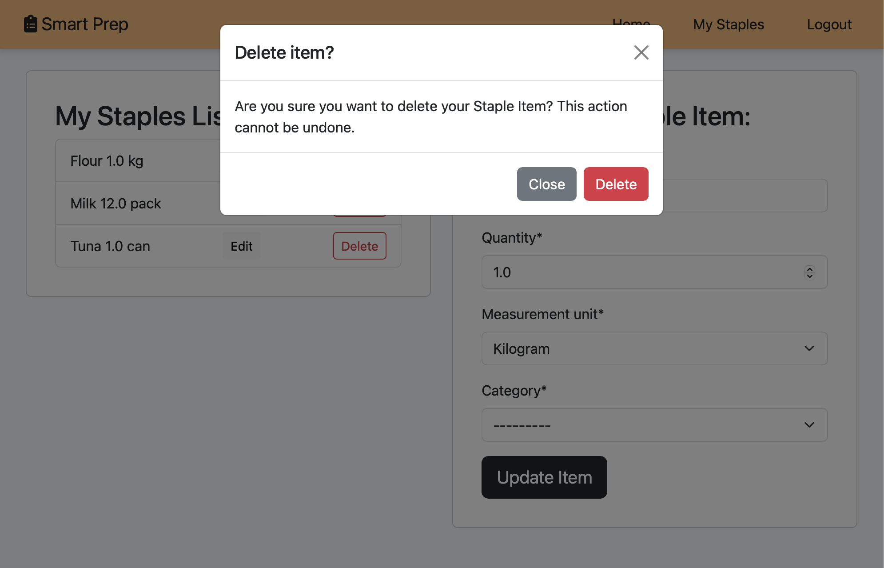
 Deletin an item: Confirmation Modal shows up. Confirmation to Delete Item. After the confirmation to User is redirected to the My Staples page and the item has been permanently deleted from the list.

#### User Authentication

Expand to see User Authentication features

 

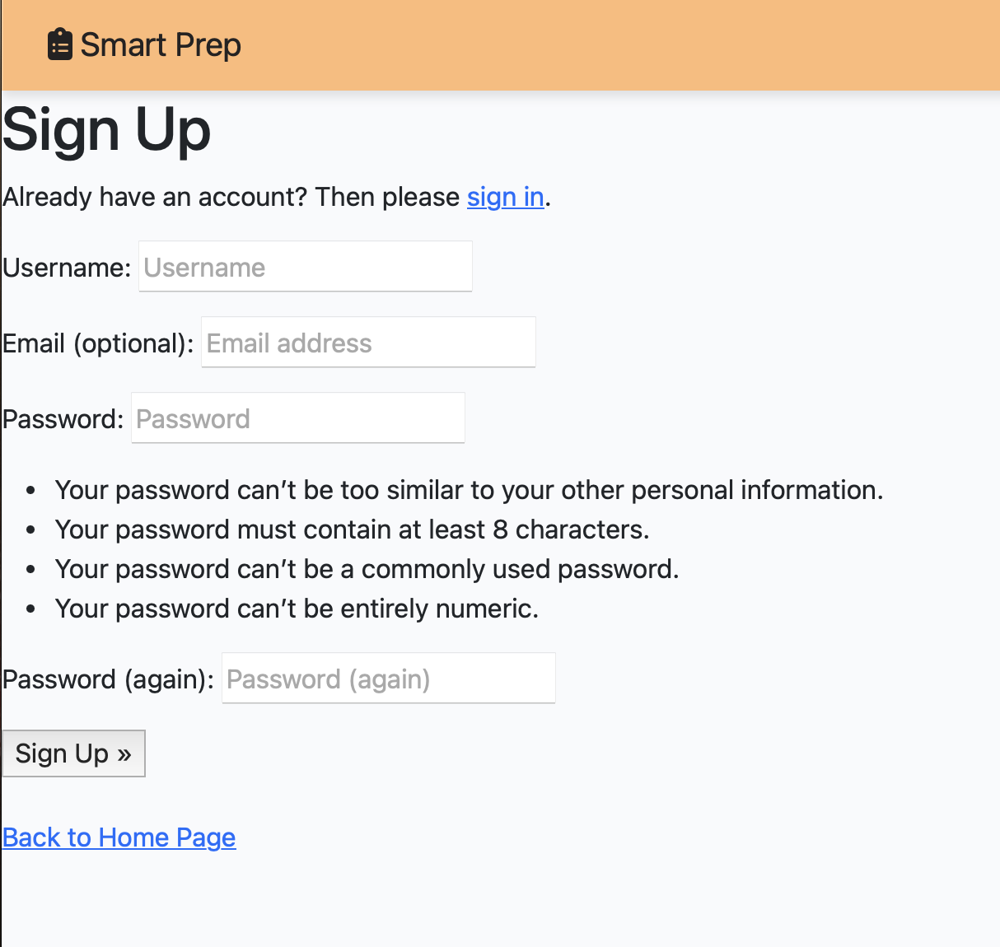
 The Sign up page

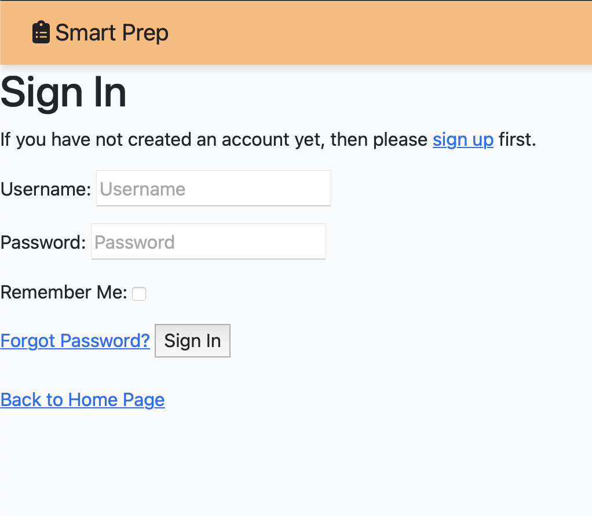
 The Sign in page

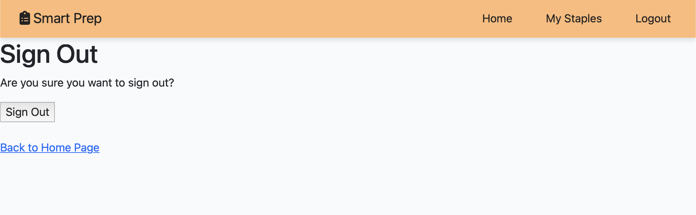
 The Logout page

#### Social Media Links

Expand to see Social Media Link feature

 

 Link to Social Media pages

#### Admin Panel and editable Welcome text

Expand to see Admin panel features

 

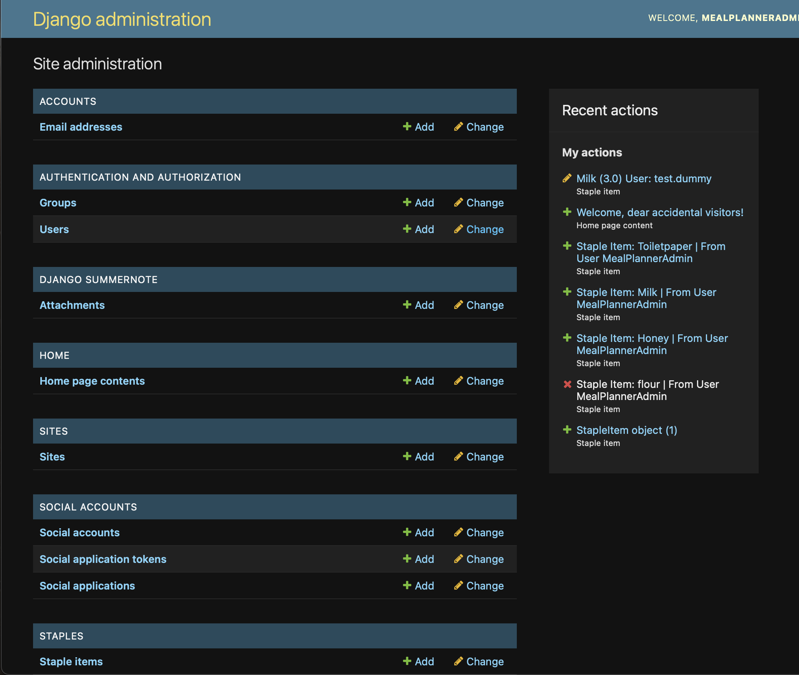
 General Admin Panel for the superuser

 Admin Panel Home Page Content Rich Text Editor

### Should-have features

- Shopping List
  - With login each user has access to their personal shopping list
  - Users can add items from the Personal Staples to the Shopping List
- Recipe Blog
  - The website contains a Recipe Blog
  - A superuser can create, edit, and delete Recipes on the blog
  - The recipes are displayed to the user: Each recipe has a specified list of grocery items per serving

### Could-Have features

- Each recipe has predefined grocery items (ingredients) with specified quantities per serving
  - Users can select a recipe and the number of servings
  - Grocery items for selected recipes in the quantity defined by selected servings is added to the shopping list
- Recipe Request Form
  - Users can suggest new recipes or provide feedback to the admin via a form
- Categorized Shopping List
  - Group grocery items into categories (e.g., produce, dairy, grains) in the shopping list
- Bulk action: Deselect all recipes/delete all items on the shopping list

### Won’t-Have features

- For now: one-to-one relationship between a user and their shopping list. Future feature: Shared Shopping Lists! (refactor the model for a many-to-many relationship model for multiple users being linked to one shopping list)
- User profile page apart from shopping list
- Comments and likes for recipes
- Portion size options for recipes (small, regular, large)
- Customizable weekly meal plans (drag-and-drop recipe servings)

### User Stories

#### Epic: Homepage / Landing page

As a visitor, I can ...  
- ... initially see the home page that introduces the idea of Smart Prep so that I can understand its purpose and benefits. 
- ... see a clear call to action to register/log in so that I am encouraged to create an account to access personalized features.

As a user, I can ... 
- ... see my login state reflected in the homepage UI so that I can confirm whether I am logged in or logged out.

#### Epic: User / Authentication

As a user, I can ...

- ... register an account so that I can access personalized features like creating and managing staple list items.
- ... log in to my account so that I can access my personal staples list.
- ... log out of my account so that I can ensure my personal data remains private.

As a superuser, I can ... 
- ... verify registered users in the admin panel so that I can ensure only legitimate accounts are accessing the website and using its features.

#### Epic: Personal Staples

As a superuser, I can ... 

- ... access the admin panel so that I can check the staples model is working and staple items can be added or modified.

As a user, I can ... 

- ... add individual staple items so that I can track my frequently purchased items and favorites.
- ... view my personal staples list so that I can see all the items I’ve added in one place.
- ... edit my own staple items so that I can update details like name, quantity, measurement unit, or category when needed.
- ... delete staple items from my own list so that I can keep my list of staples up to date.

## Testing and bugs

I documented all bugs that occured during development in my agile GitHub Projects Kanban Board. You can see all bugs with documentation and solution under the tab "Issues" of the Repository when filtering for Issues with the Label "bug", [click here to view](https://github.com/nathiedeheyl/pp4_smart-prep/issues?q=is%3Aissue%20state%3Aclosed%20label%3Abug).

When a user stories acceptance criteria were met, I tested the feature and moved the issue card to status "Done".

## Data

### ERD for models

Staple Items Model

## Technologies

- Font Awesome for icons
- Favicon.io for converting icon to favicon
- Bootstrap
- Python Allauth User Authentication
- Whitenoise to collectstatic files
- Summernotes for admin panel edit of welcome text
