# Smart Prep
## Be prepared for your next grocery shopping trip

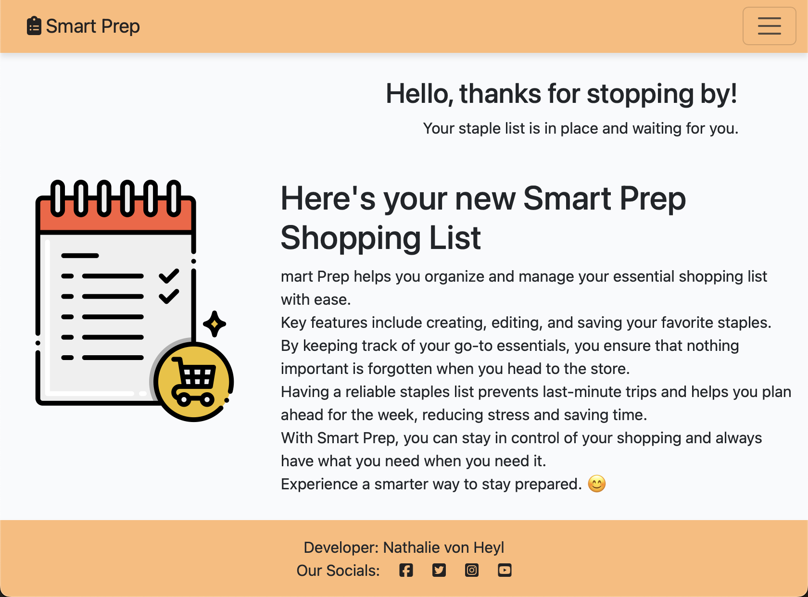

Smart Prep - 4th Portfolio Project for the Diploma in Full Stack Software Development with Code Institute. It is a full-stack website built with Django to help users stay on top of their grocery list. A registered user has access to their own shopping list (list of staples) to which they can add items, edit and delete them.

View the live website here: [Live website](https://pp4-smart-prep-3a48b801b9d3.herokuapp.com)

## User Stories

### Epic: Homepage / Landing page

As a visitor, I can ...  
- ... initially see the home page that introduces the idea of Smart Prep so that I can understand its purpose and benefits. 
- ... see a clear call to action to register/log in so that I am encouraged to create an account to access personalized features.

As a user, I can ... 
- ... see my login status reflected in the homepage UI so that I can confirm whether I am logged in or logged out.

### Epic: User / Authentication

NEW:
As a visitor, I can ... 

- ... access a registration page so that I can sign up for the service or log in to my existing user account.
- ... see an error page when trying to sign up to an account that does not yet exist.

As a user, I can ...

- ... log in to my account so that I can access my personal staples list.
- ... log out of my account so that I can ensure my personal data remains private.
NEW:
- ... change my password so that my access stays accessible and secure.
- ... see a clear feedback message when I change my password to be certain about the effected change.

As a superuser, I can ... 
- ... verify registered users in the admin panel so that I can ensure only legitimate accounts are accessing the website and using its features.

### Epic: Personal Staples

As a superuser, I can ... 

- ... access the admin panel so that I can check the staples model is working and staple items can be added to the shopping list or modified.

As a user, I can ... 

- ... add individual staple items so that I can track what I need to buy on my shopping list.
- ... view my personal shopping list so that I can see all the staple items I’ve added in one place.
- ... edit my own staple items so that I can update details like name, quantity, measurement unit, or category when needed.
- ... delete staple items from my own shopping list so that I can keep the list up to date.

## UI/UX

### Agile 

This project was designed and built using the agile approach - from initial planning to final development. To help visualise the process I created a [GitHub project](https://github.com/users/nathiedeheyl/projects/6/views/1?visibleFields=%5B%22Title%22%2C%22Assignees%22%2C%22Status%22%2C161882236%2C%22Labels%22%5D) and utilised the provided Kanban board method to split project elements into user stories and manageable tasks. On a second submission attempt I added a new [GitHub project](https://github.com/users/nathiedeheyl/projects/10/views/1) with Kanban Cards to keep track of tasks to meet the pass criteria.

To view all user stories including their required acceptance criterias and action steps, refer to the projects linked to above. Each story also has been tagged with a label to signify its priority within the MoSCoW method for managing requirements.

### Wireframes

Homepage Wireframes

Desktop Home page

Tablet Home page

Mobile Home page

Mobile Home page with Dropdown Menu

### Database Diagram (ERD for models)

Staple Items Model

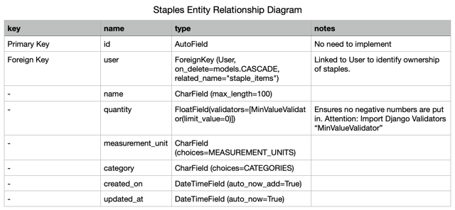

### Design

#### Color Scheme

[Color Scheme Choice](docs/ux/0_desgin_color.png)

### Target Audience

- People who would like to reduce costs of living by avoiding buying groceries in excess
- Users who would like to shop more efficiently and less often (having an organised shopping list with staples to select from enables people to go grocery shopping once and ensure they do not forget anything that will result in an unneccesary extra trip)

### User Requirements and Expectations

- Accessible and responsive website
- Intuitive website with a layout allowing to easily navigate through it
- Easy access to Create, Read, Update & Delete (CRUD) functionalities
- Links and features that function in accordance with their intended purpose
- A contact form to contact the website owner (?)

## Features

### MVP: Must-have features

- User Authentication:
  - Users can create accounts, log in and log out
  NEW:
  - Registered users are able to change their password
  - Users get feedback on success/failure of registration and log in attempts
  ...
  - Users have access to interactive features on the site only when logged it (interactive feature: CRUD staple items in a personal shopping list)
  - Features like the personal staples with functionality of adding, editing, and deleting items are not accessible to visitors
  - Login state must be reflected in the UI of homepage
- Personal Staples (CRUD)
  - Users can create, read, update and delete individual staple items
  - These staple items are stored in a persistent personal shopping list (personal meaning each user sees their own shopping list and staple items) that is editable by the user

### Existing features

#### Header

Expand to see header features

 

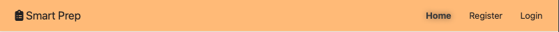
 The Header feature

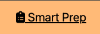
 The Brand Name and Link to Home Page

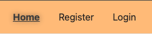
 Navigation bar

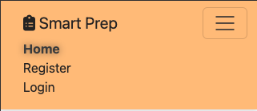
 Navigation bar: Responsive with toggle down menu for mobile screens

 Footer Feature with Social Media Links

#### Greeting to authenticated users

Expand to see greeting features

 

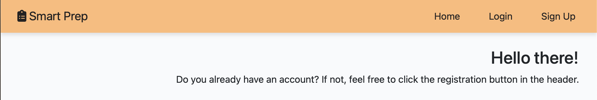
 Greeting to unauthenticated user

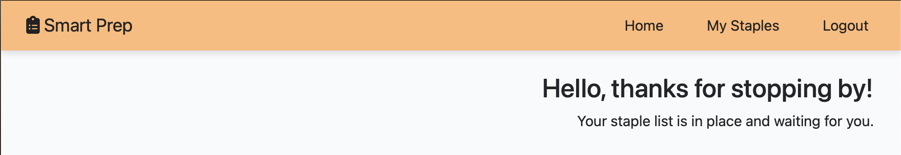
 Greeting to authenticated user

#### Introduction and welcoming paragraph on home page

Expand to see home page features

 

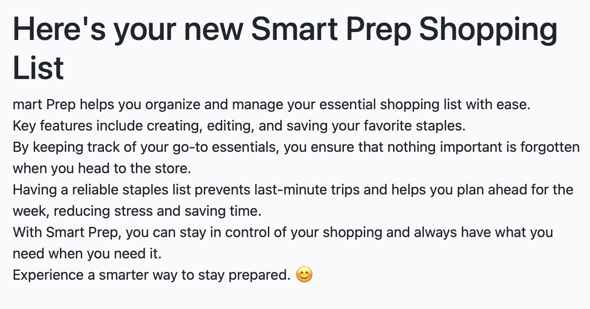
 Welcoming intro paragraph to explain the website's purpose and features to the user

#### My Staples List and Features

Expand to see Personal Staple List features

 

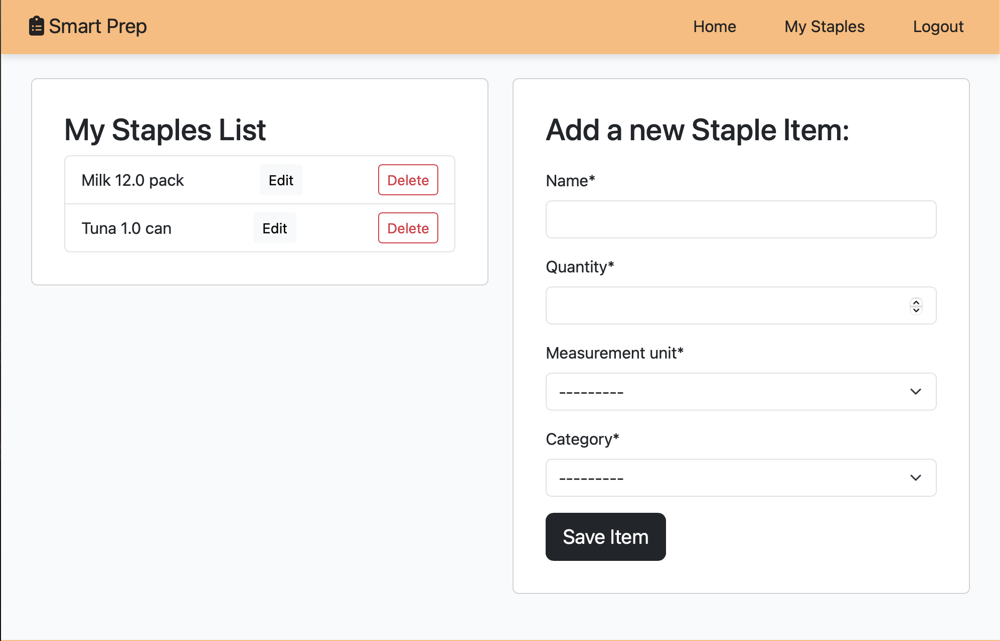
 The Staples List

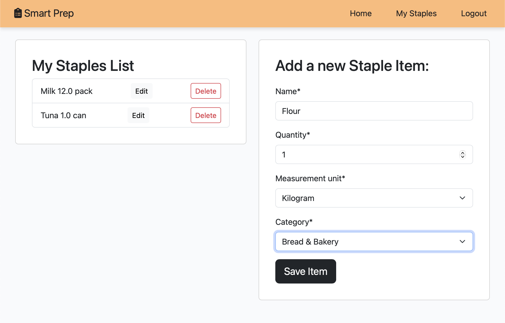
 Adding an Item

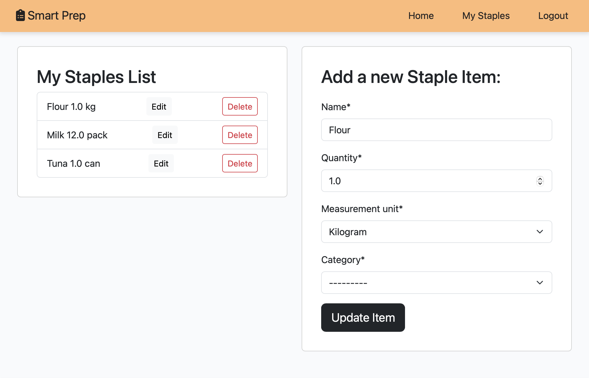
 Editing an Item

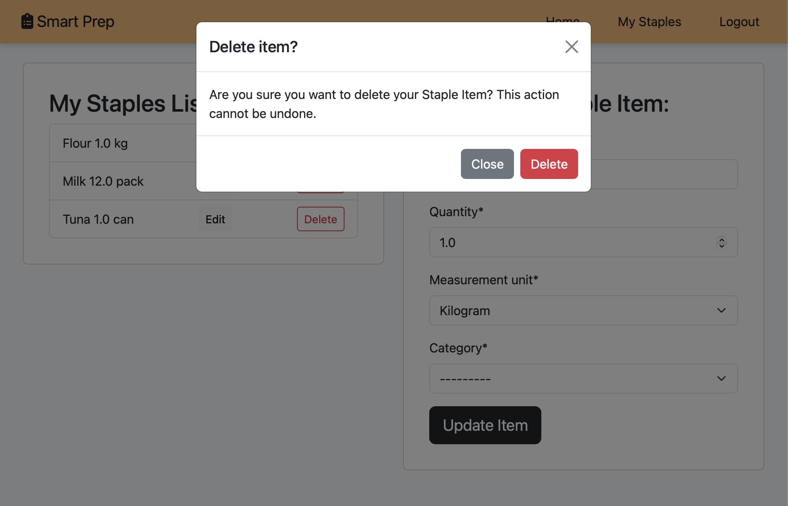
 Deletin an item: Confirmation Modal shows up. Confirmation to Delete Item. After the confirmation to User is redirected to the My Staples page and the item has been permanently deleted from the list.

#### User Authentication

Expand to see User Authentication features

 

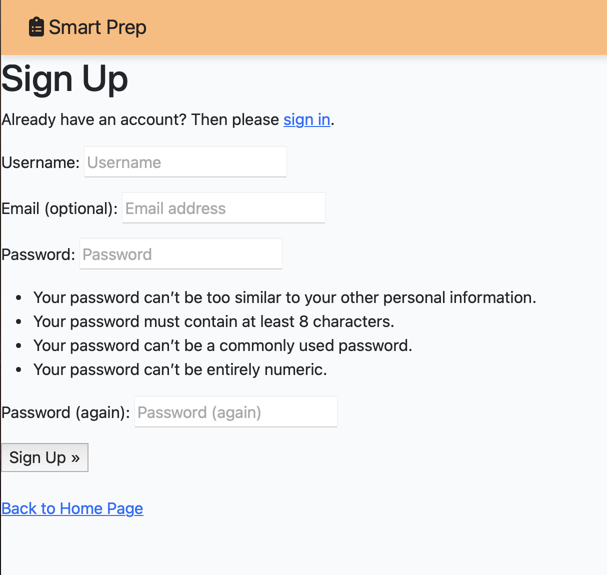
 The Sign up page

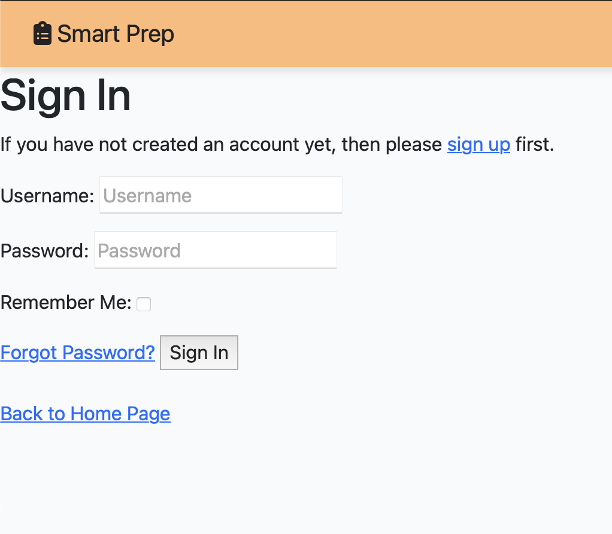
 The Sign in page

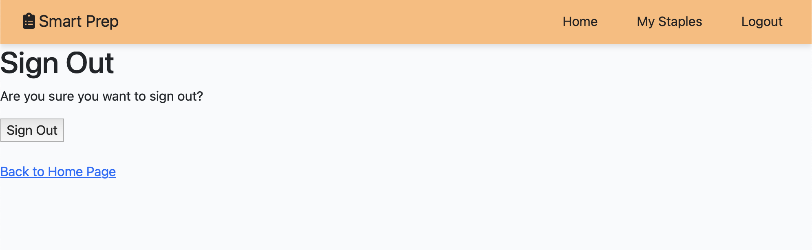
 The Logout page

#### Social Media Links

Expand to see Social Media Link feature

 

 Link to Social Media pages

#### Admin Panel and editable Welcome text

Expand to see Admin panel features

 

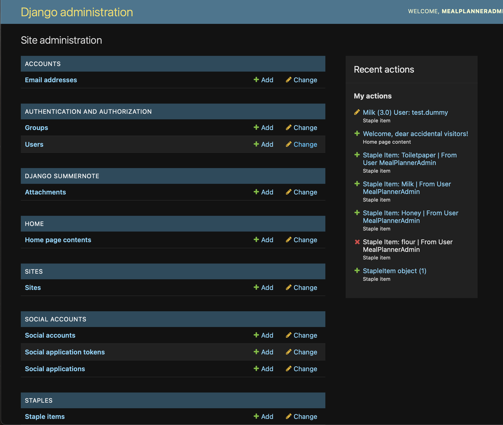
 General Admin Panel for the superuser

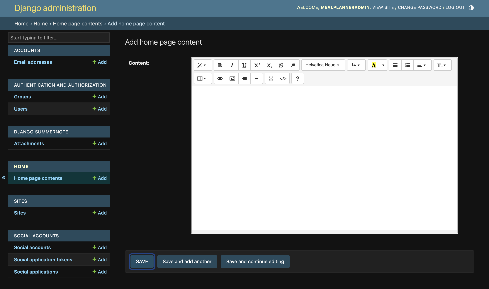
 Admin Panel Home Page Content Rich Text Editor

### Future Features

- Categorized Shopping List
  - Visibly group staple items (and future grocery items) into categories (e.g., produce, dairy, grains) in the shopping list
- Recipe Blog
  - The website contains a Recipe Blog
  - A superuser can create, edit, and delete Recipes on the blog
  - The recipes are displayed to the user: Each recipe has a specified list of grocery items per serving
  - The User can select a recipe and the amount of servings and add the thereby calculated amount of grocery items to their personal shopping list
- Comments and likes features on recipes blog posts accessible to registered users
- Recipe Request Form
  - Users can suggest new recipes or provide feedback to the admin via a form
- Bulk action: Deselect all recipes/delete all items on the shopping list
- Portion size options for recipes (small, regular, large)
- User profile page apart from shopping list
- Shared Shopping Lists (many-to-many relationship model for multiple users being linked to one shopping list)
- Customizable weekly meal plans (drag-and-drop recipe servings)

## Technologies

- Font Awesome for icons
- Favicon.io for converting icon to favicon
- Bootstrap
- Python Allauth User Authentication
- Whitenoise to collectstatic files
- Summernotes for admin panel edit of welcome text

## Testing

### User Story Testing 

### Manual Testing

#### Bugs

I documented all bugs that occured during development in my agile GitHub Projects Kanban Board. You can see all bugs with documentation and solution under the tab "Issues" of the Repository when filtering for Issues with the Label "bug", [click here to view](https://github.com/nathiedeheyl/pp4_smart-prep/issues?q=is%3Aissue%20state%3Aclosed%20label%3Abug).

##### Unfixed Bugs

### Code Validation

### Accessibility: Lighthouse

## Deployment

## Credits and Acknowledgments

